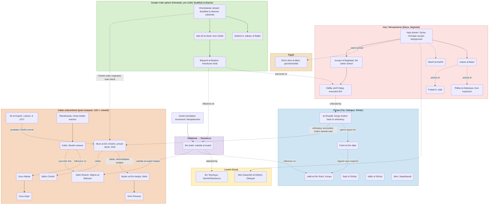

+++
title = "Sufism and Its Saints"
date = 2026-05-25
+++

> *A note on this piece. The historical narrative below is adapted from [N.B. Chatterjee's 1967 essay "Sufism and Sufi Saints"](https://vk.rkmm.org/s/vkm/m/vedanta-kesari-1967/a/10-sufism-and-sufi-saints-jun-1967), with substantial research & additions on the Khorāsānian Buddhist background drawn from more recent scholarship (van Bladel, Zaehner, Bretfeld). Where claims are contested in the literature, I have tried to flag it in the notes rather than smooth it over. This is one of my long researched articles for its accuracy & sensitivity.*

Sufism, or *taṣawwuf*, is the mystical path within Islam. It cares less for theological dogma and ritualls than for the exploration of inner self. Its origin lies in the heart of the mystical religions existed in the region during the Islamic invasion. Even among the Prophet's companions, some withdrew from worldly ambition to lead lives of austerity, and this impulse hardened into a tradition in the centuries that followed.[^1]

## How Sufism Began

By the 7th and 8th centuries CE, Islam had become a religion of conquest, and a number of pious Muslims found this troubling. The worldliness of the new empire seemed to them to be eroding the religious life. The tyranny and impiety of the Umayyad rulers (661 to 750 CE) deepened the conviction. Sincere believers withdrew into seclusion, contemplation, and renunciation. The world began to look like an illusion, and the next world began to look more real.

So far, this is an internal story. The earliest ascetic Sufism, gathered around Ḥasan al-Baṣrī in Iraq, can be read as a reaction within Islam to the corruption of the caliphate, drawing on a few esoteric strands in the Prophet's own sayings such as "Whoever knoweth himself, knoweth God" and "I was a hidden treasure and I desired to be known".[^2] The contemplative culture immediately to hand in Mesopotamia was Syriac Christian monasticism, and the resemblance shows.[^3] This is the Iraqi stream.

But Sufism has a second stream, and it is the more interesting one. The doctrines that give mature Sufism its distinctive content, immanence of the divine, the annihilation of the self in God (*fanā*), the graded inner path with its stations and states, the master-disciple lineage, did not arise in Iraq. They arose in Khorāsān, the eastern Iranian world. And Khorāsān before Islam was a Buddhist country.[^4]

The geography is worth taking seriously. Balkh, Bāmiyān, Termez, and the cities along the Oxus had been Buddhist for centuries. The Nava Vihāra (Naw Bahār) near Balkh was a major monastic centre, still functioning into the early Islamic period. The Chinese pilgrim Xuanzang, visiting Balkh around 630 CE, counted roughly a hundred *vihāras* and thirty thousand monks in the region.[^5] The Barmakid family, who served as viziers to the early Abbāsids and ran the translation movement at Baghdad, were the hereditary administrators of Naw Bahār. Their family title *barmak* is from the Sanskrit *pramukha*, chief.[^6] The Buddhist substrate was not a distant cultural memory at the time Sufism was forming. It was the recent past, and in places the present.

The biographies follow the geography. Ibrāhīm Adham, named in every history of early Sufism, was the king of Balkh, which is to say the king of the city housing Naw Bahār. His conversion narrative is structurally identical to the Buddha's: a prince leaves his throne after a sudden encounter with the futility of worldly life, and takes up the life of a wandering ascetic. The parallel has been noted by every serious scholar of the tradition.[^7] Bāyazīd al-Bisṭāmī, who introduced *fanā* into Sufism, is reported in early sources to have studied with Abū Alī al-Sindī, a teacher whose name marks him as from Sindh and who, on R.C. Zaehner's reading, transmitted to Bāyazīd concepts drawn from the *Chāndogya* and *Śvetāśvatara* Upaniṣads.[^8] The terminological parallels run deep. *Pīr* and *murīd* map onto *guru* and *śiṣya*. *Dhikr* maps onto *mantra-japa*. *Ṭarīqa* and *mārga* are the same word. *Fanā* and *nirvāṇa* describe the same target.[^9]

The Greek translation movement of the late 8th and 9th centuries CE then gave this contemplative culture a philosophical vocabulary. Plotinian Neoplatonism, with its One and its emanations, sat easily alongside the dharmic content already present, and the mature Sufi metaphysics of Ibn Arabī is the result.[^10] Al-Bīrūnī's 11th-century CE Arabic translations of the *Sāṅkhya* of Kapila and the *Yoga Sūtra* of Patañjali came later, but they confirm the direction of the traffic.[^11]

This leaves a theological problem that the orthodox Islam recognised clearly. The Qurān insists on the absolute transcendence of God, that He is "not like anything" (Q 42:11). The Sufi doctrines of *ḥulūl* (indwelling), *ittiḥād* (union), and eventually *waḥdat al-wujūd* (the unity of being) sit very awkwardly inside that theology. Ḥallāj was **executed** for exactly this tension.[^12] Ibn Taymiyya in the 14th century CE attacked Ibn Arabī on the same grounds.[^13] The Sufi reply was hermeneutic: the Qurān has an outer meaning (*ẓāhir*) and an inner meaning (*bāṭin*), and verses like "closer than the neck-vein" (Q 50:16) and "wherever ye turn, there is the face of God" (Q 2:115) support the mystical reading. But the *ẓāhir*/*bāṭin* distinction is itself a Sufi innovation, and the literalists rejected it.

The honest description is probably this. Sufism is an Islamic vessel that absorbed a great deal of contemplative content from the traditions it encountered as Islam spread east. The ascetic shell came from the Iraqi-Christian environment. The mystical core came from the Buddhist and dharmic substrate of Khorāsān, with Neoplatonic philosophy supplying a later vocabulary. Whether to call this "influence" or "origin" is a question of how much continuity one requires before the label changes.

## From Asceticism to Ecstatic Love

The earliest Sufis, in the 7th century CE, were ascetics. They renounced possessions and pleasure for a life devoted to God. The outstanding figure of this first phase was Ḥasan of Baṣra (d. 728 CE).

By the end of that first century, the mood had begun to shift. Asceticism was no longer the goal but a means. The point was contemplation, vision, and ecstasy. Three figures define this transition. Ibrāhīm b. Adham of Balkh (d. 783 CE), already met above. Fuḍayl b. Iyāḍ (d. 801 CE), a former bandit chief. And Rābia al-Adawiyya (d. 802 CE), a former slave girl, who gave the tradition something new: prayer as intimate conversation with God.

Her best-known prayer reads:

> O my Lord, if I worship Thee from fear of Hell, burn me in Hell; and if I worship Thee from hope of Paradise, exclude me thence; but if I worship Thee for Thine own sake, then withhold not from me Thine Eternal Beauty.[^14]

Rābia has often been compared to Mīrābāī. The comparison is apt. Both loved God without conditions.

By the 9th century CE, Sufis were thinking of God as immanent, dwelling within the human being, and of the path as an ascent of the self toward Him through love and renunciation. Marūf al-Karkhī (d. 815 CE), Abū Sulaymān al-Dārānī (d. 830 CE), and the Egyptian Dhū'n-Nūn al-Miṣrī gave shape to this new mysticism of ecstasy and gnosis (*marifat*).

Later in the same century, Abū Yazīd al-Bisṭāmī (Bāyazīd) introduced the doctrine of *fanā*, the annihilation of the self and its identification with God (sounds familiar?). He went one step above and his sayings shocked the orthodox: "Beneath this cloak of mine, there is nothing but God"; "Glory to me! How great is my majesty!"; "Verily I am God; there is no God besides me, so worship me."[^15] The greatest of the pantheistic Sufis was Ḥusayn b. Manṣūr al-Ḥallāj, born in Persia in 858 CE. He declared *anāl-Ḥaqq*, "I am the Truth", and was imprisoned for eight years and then **executed** in 922 CE.[^16]

Sufism at this point was widely viewed as heresy. It took al-Ghazālī (b. 1058 CE) to bring it back inside the fold. He divided seekers after truth into theologians, philosophers, authoritarians, and mystics. He was himself a Sufi, though he criticised the extreme claims of Ḥallāj.[^17] After al-Ghazālī, Sufism was no longer fringe.

## The Classical Age

The 12th and 13th centuries CE were the classical period of Sufism. Persia was its centre, and most of its great voices wrote in Persian: Farīd al-Dīn Aṭṭār (b. 1119 CE), Jalāl al-Dīn Rūmī (b. 1207 CE), and Sadī (b. 1184 CE). In the 14th and 15th centuries CE they were followed by Ḥāfiẓ (d. 1389 CE) and Jāmī (b. 1414 CE).

Aṭṭār writes of the unity of all that exists:

> The world is full of Thee and Thou art not in the world.
> All are lost in Thee and Thou art not in the midst.

Rūmī writes of intoxication without wine, of the king hidden in a beggar's robe, and of the lover who has cast a glance at the Lord of the Soul. On the question of what makes a true Sufi, he is direct:

> What makes the Sufi? Purity of heart;
> Not the patched mantle and the lust perverse
> Of those vile earth-bound men who steal his name.

## A Timeline of the Saints

## Lineage and Influence

Solid arrows mark attested teacher-to-disciple links; dashed arrows mark broader influence, succession, or polemic. The two-stream split (Iraqi/sober vs. Khorāsānian/intoxicated) follows Schimmel; see [^4]. Figures are grouped by the region they worked in: Iraq, the Levant, Egypt, Khorāsān (which lay inside the Greater Indic cultural sphere at the time), Andalusia, Persia, and the Indian subcontinent proper.

## The Seven Stages of the Inward Path

Sufis believe that God is separated from the world of matter and sense by seventy thousand veils. The path inward breaks through these veils in seven stages.[^18]

1. *Ubūdiyyat*, awakening. The aspirant, after initiation (*tawajjuh*) from a teacher (*murshid*), begins to purify the soul through repentance and discipline.
2. *Ishq*, love. An intense love for God grows through constant remembrance (*dhikr*).
3. *Zuhd*, renunciation. As love deepens, the world loosens its hold.
4. *Marifat*, gnosis. The aspirant meditates on the nature and attributes of God.
5. *Wajd*, ecstasy. The individual self is lost so that the universal self may be found.
6. *Ḥaqīqat*, reality. The heart is illumined by the true nature of God, and the aspirant learns *tawakkul*, dependence on God.
7. *Waṣl*, union. The mystic feels identity with God, before the final experience of *fanā wa baqā*, annihilation and subsistence.

## Sufism and the Indian Traditions

The Sufi path runs strikingly close to the *bhakti* tradition of the *Nārada Bhakti Sūtra* and the Vaiṣṇava schools. The Hindu tradition recognises five attitudes the devotee may take toward God: *śānta*, *dāsya*, *sakhya*, *vātsalya*, and *madhura*. Sufism works almost entirely in the last of these, the mode of the lover.

There are other points of contact. The Sufi *lataif* resemble the *ṣaṭ-cakras* of yoga. *Fanā* sits close to *nirvāṇa* or *samādhi*. The Sufi conception of *baqā*, subsistence in God, is close to *mokṣa* and to the Upaniṣadic formula *brahmavid brahmaiva bhavati*, the knower of Brahman becomes Brahman.

The Mughal prince Dārā Shukoh, himself a Sufi, made the comparison explicit in his book *Majma al-Baḥrayn*, "The Meeting of the Two Seas". He translated the Upaniṣads, the *Gītā*, and the *Yogavāsiṣṭha* into Persian in the hope of showing that the two traditions met at their deepest point.[^19]

## Sufism in India

Many Sufis came to India in the wake of the Muslim conquests, and many became saints, revered by Hindus as well as Muslims. Alī al-Hujwīrī, known as Data Ganj Bakhsh, lived in Lahore until his death in 1071 CE. Khwāja Muīn al-Dīn Chishtī came to Ajmer in 1165 CE, and his shrine remains one of the largest in India. Niẓām al-Dīn Awliyā lived in Delhi through the 13th and 14th centuries CE, across the reigns of seven Pathān rulers, and his disciple Amīr Khusrau wrote great poetry in Persian and Urdu. Salīm Chishtī lived in the time of Akbar, whose poems I have studied during my school days.

The figure who brought the two traditions closest was Kabīr (again, whose poems I studied during school days), a Muslim weaver initiated by Rāmānanda. He saw no difference between Rāma and Khudā, between the Vedas and the Qurān. "Rāma, Khudā, Śakti, Śiva are one", he said. "Then to whom do the prayers go?" His influence on Guru Nānak and Guru Arjan is clear, and Sufis count Guru Arjan as one of their own.

Four Sufi orders were prominent in India: the Chishtī, the Suhrawardī, the Qādirī, and the Naqshbandī.[^20]

## Decline

After the classical age, the tradition began to decay due to the force of orthodox Islam. Miraculous legends attached themselves to the names of the great mystics. The credulous masses began to prefer imposture to true devotion. The cult of saints, which orthodox Islam had always resisted, encouraged superstition. Learning was held in contempt under the guise of piety. As Rūmī had warned, the vile earth-bound men, in their patched mantles, stole the name of Sufi.

The form survived, but the inner life that had given it meaning, vanished.

---

## Notes

[^1]: N.B. Chatterjee, "Sufism and Sufi Saints", *Prabuddha Bharata* (June 1967), is the base text for the historical narrative below. The framing and the Khorāsānian additions are mine.

[^2]: Both sayings are well known in Sufi literature but stand on weak ḥadīth ground. "Whoever knoweth himself, knoweth God" (*man arafa nafsahu fa-qad arafa rabbahu*) is not in any of the canonical collections and is judged inauthentic or weak by classical ḥadīth scholars; al-Nawawī and Ibn Taymiyya both rejected it. The "hidden treasure" saying (*kuntu kanzan makhfiyyan*) is a ḥadīth *qudsī* widely cited by Ibn Arabī and later Sufis but, again, not in the canonical collections; Ibn Taymiyya called it fabricated. Their function in the tradition is more important than their isnād.

[^3]: Tor Andrae, *In the Garden of Myrtles: Studies in Early Islamic Mysticism*, trans. Birgitta Sharpe (SUNY Press, 1987; original Swedish 1947), remains the standard treatment of the Syriac Christian background of early Iraqi asceticism. See also Margaret Smith, *Studies in Early Mysticism in the Near and Middle East* (1931).

[^4]: This two-stream reading is not original to me. It is broadly the picture in Annemarie Schimmel, *Mystical Dimensions of Islam* (University of North Carolina Press, 1975), chapters 1 and 2, which distinguishes the sober Iraqi tradition (Ḥasan al-Baṣrī, Junayd) from the intoxicated Khorāsānian tradition (Ibrāhīm b. Adham, Bāyazīd, Ḥallāj's predecessors). The Buddhist substrate of Khorāsān is documented in Richard Foltz, *Religions of the Silk Road*, 2nd ed. (Palgrave Macmillan, 2010), and in Anna Akasoy, Charles Burnett and Ronit Yoeli-Tlalim, eds., *Islam and Tibet: Interactions along the Musk Routes* (Ashgate, 2011).

[^5]: Xuanzang's account is in the *Da Tang Xiyu Ji* (*Great Tang Records on the Western Regions*), translated by Samuel Beal as *Si-Yu-Ki: Buddhist Records of the Western World* (Trübner, 1884), vol. 1. The Yijing/I-Tsing report from the 680s identifies Nava Vihāra as a Sarvāstivādin centre.

[^6]: Kevin van Bladel, "The Bactrian Background of the Barmakids", in Akasoy, Burnett and Yoeli-Tlalim, eds., *Islam and Tibet* (2011), pp. 43-88, is now the definitive treatment. Van Bladel corrected the older Orientalist assumption that the Barmakids were Zoroastrian; the family was Buddhist, and *barmak* is from the Sanskrit *pramukha*. The traditional Arabic identification of Naw Bahār as a fire-temple was a confusion.

[^7]: The Buddha parallel is noted by Reynold A. Nicholson, *The Mystics of Islam* (G. Bell, 1914), and developed in Schimmel, *Mystical Dimensions* (1975). A detailed comparative study is Sven Bretfeld, "Muslim Buddhas? Ibrāhīm ibn Adham and al-Khiḍr" (available on Academia.edu), which treats both the structural parallel and the limits of the evidence for direct transmission. Russell Jones traced the diffusion of the Ibrāhīm legend across the Islamic world in his work on the *Hikayat Sultan Ibrahim*. The earliest hagiographies, including Aṭṭār's *Tadhkirat al-Awliyā* and accounts by Abū Nuaym al-Iṣfahānī, are the source texts.

[^8]: R.C. Zaehner, *Hindu and Muslim Mysticism* (Athlone Press, 1960), chapter 4, makes the case that Abū Alī al-Sindī's teachings on *fanā* and the unreality of the phenomenal world derive from the *Chāndogya* and *Śvetāśvatara* Upaniṣads, transmitted as he interpreted them. The Sindī connection is preserved in the early sources collected by Alī b. Uthmān al-Hujwīrī, *Kashf al-Maḥjūb*, trans. Nicholson (Luzac, 1911). The reading is not universally accepted; some scholars argue al-Sindī was a Muslim of Sindhī origin without a specifically Hindu or Buddhist background, and that the technique-exchange story is later embellishment. Zaehner's case rests on doctrinal content rather than biographical detail.

[^9]: The terminological parallels are noted in general surveys of comparative mysticism; see Schimmel (1975), pp. 11-22, and William Stoddart, *Outline of Sufism: The Essentials of Islamic Spirituality* (World Wisdom, 2012), for accessible treatments. The *ṭarīqa*/*mārga* etymological identity is direct (Indo-European root).

[^10]: Dimitri Gutas, *Greek Thought, Arabic Culture: The Graeco-Arabic Translation Movement in Baghdad and Early Abbasid Society* (Routledge, 1998), is the standard work on the translation movement. The Neoplatonic shape of Ibn Arabī's metaphysics is discussed in William Chittick, *The Sufi Path of Knowledge* (SUNY Press, 1989).

[^11]: Edward C. Sachau, ed. and trans., *Alberuni's India* (Trübner, 1888), 2 vols., remains the standard English edition.

[^12]: Louis Massignon, *La Passion de Husayn ibn Mansûr Hallâj* (1922), translated as *The Passion of al-Hallaj: Mystic and Martyr of Islam* by Herbert Mason, 4 vols. (Princeton University Press, 1982), is the definitive biography.

[^13]: Ibn Taymiyya's critique of Ibn Arabī is scattered across his *Majmū al-Fatāwā* and treated systematically in Alexander Knysh, *Ibn Arabī in the Later Islamic Tradition: The Making of a Polemical Image in Medieval Islam* (SUNY Press, 1999).

[^14]: Translation as in Margaret Smith, *Rabia the Mystic and Her Fellow-Saints in Islām* (Cambridge University Press, 1928), p. 30. Smith's biography remains the standard.

[^15]: The *shaṭaḥāt* of Bāyazīd are collected in Abd al-Raḥmān Badawī, *Shaṭaḥāt al-Ṣūfiyya* (Cairo, 1949). A recent critical study is Mojan Membrado, *Bayazid: The Life and Teachings of the Mystic Abū Yazīd al-Basṭāmī* (Brill, 2024).

[^16]: Massignon (1982), as above. The eight-year imprisonment and 922 CE execution under the Caliph al-Muqtadir are well-attested.

[^17]: Al-Ghazālī's autobiography *al-Munqidh min al-Ḍalāl* (*Deliverance from Error*) sets out the fourfold division of seekers. See W. Montgomery Watt, *The Faith and Practice of al-Ghazālī* (Allen and Unwin, 1953).

[^18]: The sevenfold scheme given here follows the Chatterjee article (1967). Different Sufi authorities give different schemes, typically with seven *maqāmāt* (stations) and a parallel set of *aḥwāl* (states); the classic formulation is in Abū Naṣr al-Sarrāj, *Kitāb al-Luma* (10th century CE), ed. Nicholson (Brill, 1914). The seventy-thousand-veils image is from a ḥadīth reported by Muslim.

[^19]: Dārā Shukoh, *Majma al-Baḥrayn*, ed. and trans. M. Mahfuz-ul-Haq (Asiatic Society of Bengal, 1929). His Persian translation of the Upaniṣads, the *Sirri Akbar* (1657), was the route by which Anquetil-Duperron's Latin *Oupnek'hat* (1801) reached Schopenhauer and the European Romantics.

[^20]: Standard treatment in K.A. Nizami, *Some Aspects of Religion and Politics in India During the Thirteenth Century* (Aligarh, 1961), and more recently Richard M. Eaton, *Essays on Islam and Indian History* (Oxford University Press, 2000).
